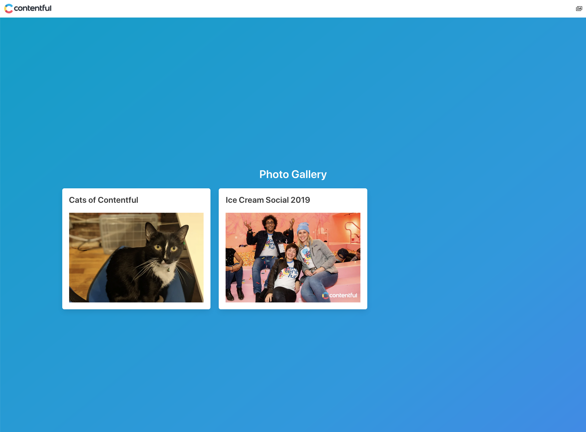
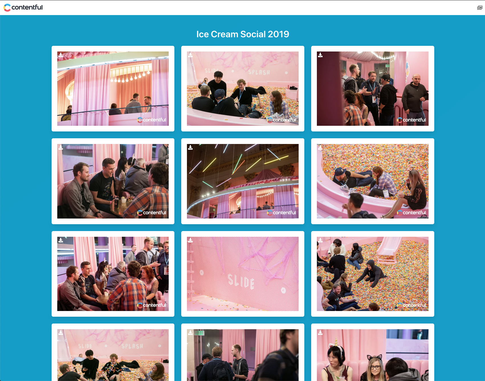
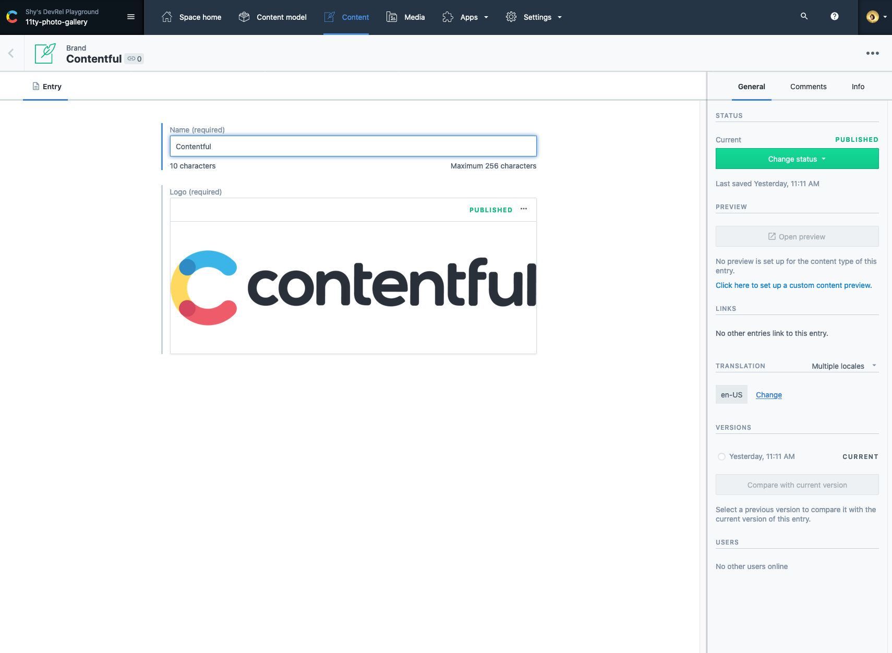
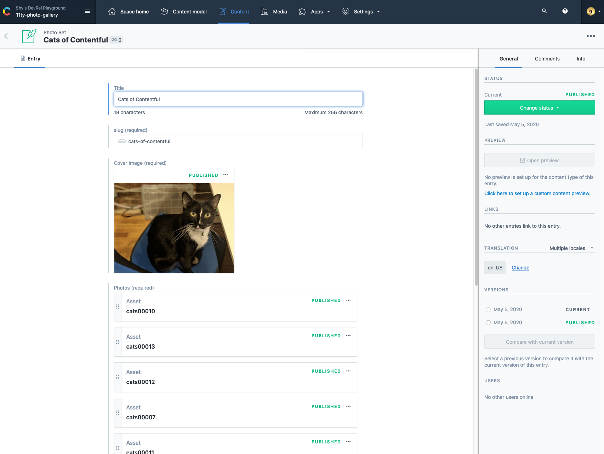
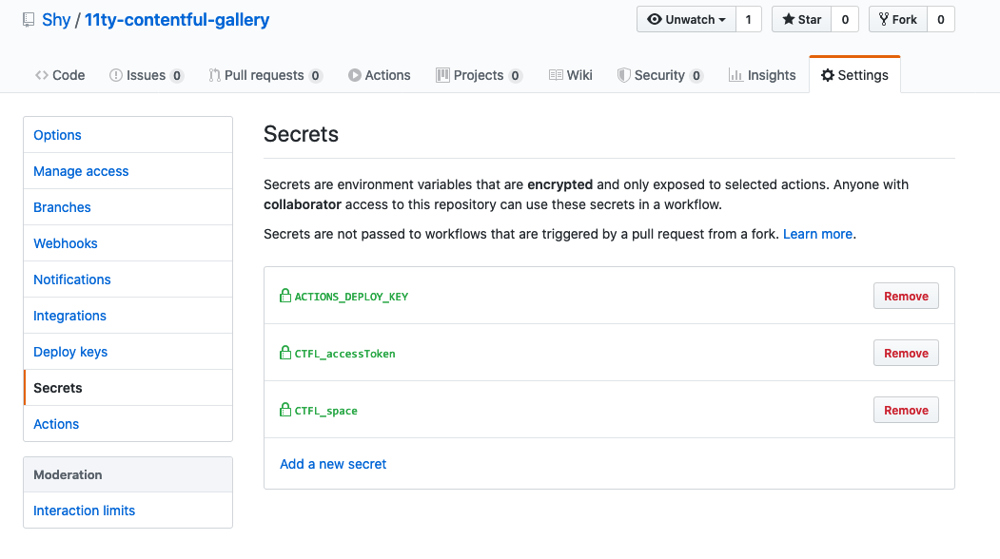

11ty-contentful-gallery
=====

An example photo gallery made using [Contentful](https://www.contentful.com/) and [11ty](https://www.11ty.dev/). It's automatically deployed via GitHub Actions and then hosted by GitHub Pages. Data lives in Contentful, code lives with GitHub, and that's all the services you need to deploy and host a static site.



What is this about?
=====

This example contains [11ty Javascript Data Files](https://www.11ty.dev/docs/data-js/) that take Contentful provided content to build a photo gallery. The front end utilizes [Bulma](https://bulma.io/) for layout and styling. When code is committed or content is published, a build process is triggered that utilizes [GitHub Actions for GitHub Pages](https://github.com/peaceiris/actions-gh-pages) to build and deploy the website.



Getting started
=====

### Requirements

To deploy this project you'll need accounts for the following services:

- [Contentful](https://www.contentful.com)
- GitHub

### Setup

* Fork and clone this repository

#### The Contentful part (optional)

This repo currently uses an existing Contentful space. If you'd like to replace this space with your own, so you can modify the content, you're welcome to do so.

* Create a new space using the [Contentful CLI](https://github.com/contentful/contentful-cli)

```console
$ contentful space create --name "11ty-gallery"
? Do you want to confirm the space creation? Yes
Your user account is a member of multiple organizations. Please select the organization you would like to add your Space to.
? Please select an organization: Shy's DevRel Playground (orgid)
✨  Successfully created space 11ty-gallery (rea8ci0yln66)
```
* Set the newly created space as default space for all further CLI operations. You'll be presented with a list of all available spaces – choose the one you just created.
```console
$ contentful space use
? Please select a space: 11ty-photo-gallery (rea8ci0yln66)
Now using the 'master' Environment of Space 11ty-photo-gallery (rea8ci0yln66) when the `--environment-id` option is missing.
```

* Import the provided content model (`./import/export-content-models-only.json`) into the newly created space.
    * If you'd prefer to import a version with content you can use `./import/export.json`. This will take longer given that it includes many assets from our past events.
```console
$ contentful space import --content-file import/export-content-models-only.json

┌──────────────────────────────────────────────────┐
│ The following entities are going to be imported: │
├─────────────────────────────────┬────────────────┤
│ Content Types                   │ 2              │
├─────────────────────────────────┼────────────────┤
│ Editor Interfaces               │ 2              │
├─────────────────────────────────┼────────────────┤
│ Locales                         │ 1              │
├─────────────────────────────────┼────────────────┤
│ Webhooks                        │ 0              │
├─────────────────────────────────┼────────────────┤
│ Entries                         │ 0              │
├─────────────────────────────────┼────────────────┤
│ Assets                          │ 0              │
└─────────────────────────────────┴────────────────┘
 ✔ Validating content-file
 ✔ Initialize client (1s)
 ✔ Checking if destination space already has any content and retrieving it (1s)
 ✔ Apply transformations to source data (1s)
 ✔ Push content to destination space
   ✔ Connecting to space (1s)
   ✔ Importing Locales (1s)
   ✔ Importing Content Types (4s)
   ✔ Publishing Content Types (2s)
   ✔ Importing Editor Interfaces (1s)
   ✔ Importing Assets (4s)
   ✔ Publishing Assets (0s)
   ✔ Archiving Assets (1s)
   ✔ Importing Content Entries (4s)
   ✔ Publishing Content Entries (1s)
   ✔ Archiving Entries (0s)
   ✔ Creating Web Hooks (0s)
Finished importing all data
┌───────────────────────┐
│ Imported entities     │
├───────────────────┬───┤
│ Locales           │ 1 │
├───────────────────┼───┤
│ Content Types     │ 2 │
├───────────────────┼───┤
│ Editor Interfaces │ 2 │
├───────────────────┼───┤
│ Assets            │ 0 │
├───────────────────┼───┤
│ Published Assets  │ 0 │
├───────────────────┼───┤
│ Archived Assets   │ 0 │
├───────────────────┼───┤
│ Entries           │ 0 │
├───────────────────┼───┤
│ Published Entries │ 0 │
├───────────────────┼───┤
│ Archived Entries  │ 0 │
├───────────────────┼───┤
│ Webhooks          │ 0 │
└───────────────────┴───┘
The import took a few seconds (13s)
No errors or warnings occurred
The import was successful.
```

* On Contentful we have 2 Content Types. `Brand` and `photoSets`.
  * `Brand` is used to set the logo at the top of each page and name the website. You should only have one instance of this content type. For this example go ahead and create that now.
  * 
  * `photoSet` is where each set of photos lives. You can create as many of these, with as many photos as you want. For this example create at least one.
  * 

* Update the space id and access token in [.env](.env) to use the api keys from your newly created space.

#### Build the site

* On the command line, navigate to your cloned repo and install your dependencies with `npm install`.
* Run Eleventy with `npx eleventy --serve`. We're using the `--serve` argument so eleventy will host the site for us. Navigiate to [localhost:8080](http://localhost:8080) (or whatever port 11ty provides you if 8080 is already in use) to view the site.
```console
$ npx eleventy --serve
Writing _site/README/index.html from ./README.md.
Writing _site/index.html from ./index.liquid.
Writing _site/cats-of-contentful/index.html from ./photoSet-pages.liquid.
Writing _site/ice-cream-social-2019/index.html from ./photoSet-pages.liquid.
Benchmark (Data): `./_data/contentful-brand.js` took 271ms (18.5%)
Benchmark (Data): `./_data/contentful-photos.js` took 224ms (15.3%)
Wrote 4 files in 1.21 seconds (v0.10.0)
Watching…
[Browsersync] Access URLs:
 --------------------------------------
       Local: http://localhost:8080
    External: http://192.168.1.137:8080
 --------------------------------------
          UI: http://localhost:3001
 UI External: http://localhost:3001
 --------------------------------------
[Browsersync] Serving files from: _site
```

#### The GitHub part (optional)

Since we're using GitHub Actions, we'll be able to use the existing [GitHub Actions for GitHub Pages](https://github.com/peaceiris/actions-gh-pages) repo. This repo contains a build script that will trigger when you make a [push](.github/workflows/push_build.yml) and one that can be triggered [via a webhook from Contentful](.github/workflows/contentful_build.yml). This build will run eleventy and then publish your site to the `gh_pages` branch of your repo.


On your forked repo you'll need to [add an SSH Deploy key so GitHub actions will be able to deploy to GitHub pages](https://github.com/peaceiris/actions-gh-pages#%EF%B8%8F-create-ssh-deploy-key). This should be a new SSH Key that you only use in this context. Don't reuse your existing GitHub SSH keys if you've got one. Lastly add the environment variables for Contentful in the GitHub Secrets page. Optionally you can activate Google Analytics tracking by including your `GOOGLE_TRACKING_ID` in the GitHub Secrets page.



That's everything we need for building on a push to the repo. We've got a few more steps to make it so Contentful is able to trigger a rebuild. In your GitHub Developer settings create a new personal access token and give it the repo scope.


Head over to your Contentful space and in the settings menu acess the Webhooks section page click Add Webhook. Name it `GitHub Action Trigger`. For the URL make sure your using a POST call with the URL as `https://api.github.com/repos/{GitHub User Name}/{Your Repo Name}/dispatches` replacing `{GitHub User Name}` and `{Your Repo name}` with the information from your repo. Set the triggers to be just for Publish & Unpublish events on Entries. Add the following 3 headers, `Accept: application/vnd.github.mercy-preview+json`, `USER-AGENT: Contentful`, and `Authorization: Bearer {GitHub Personal Access Token}` replacing `{GitHub Personal Access Token}` with the token you generated in your developer settings. Lastly set the Content type to `application/json` and the payload to custom with the following json blob `{"event_type": "publish-event"}`.


Hit Save and now when you hit publish on any entry it'll trigger a rebuild via GitHub Actions.


Implementation Notes
=======

* This example uses one layout:
    - `_includes\layout.liquid`: the top level HTML structure
 * This example uses [liquid](https://www.11ty.dev/docs/languages/liquid/) templates to generate pages.
   - `index.liquid` generates the homepage
   - `photoSet-pages.liquid` takes a look for all content on Contentful of type `photoSet`. It creates a directory for each photoSet.

License
=======

Copyright (c) 2020 Contentful GmbH. Code released under the MIT license. See [LICENSE](LICENSE) for further details.
